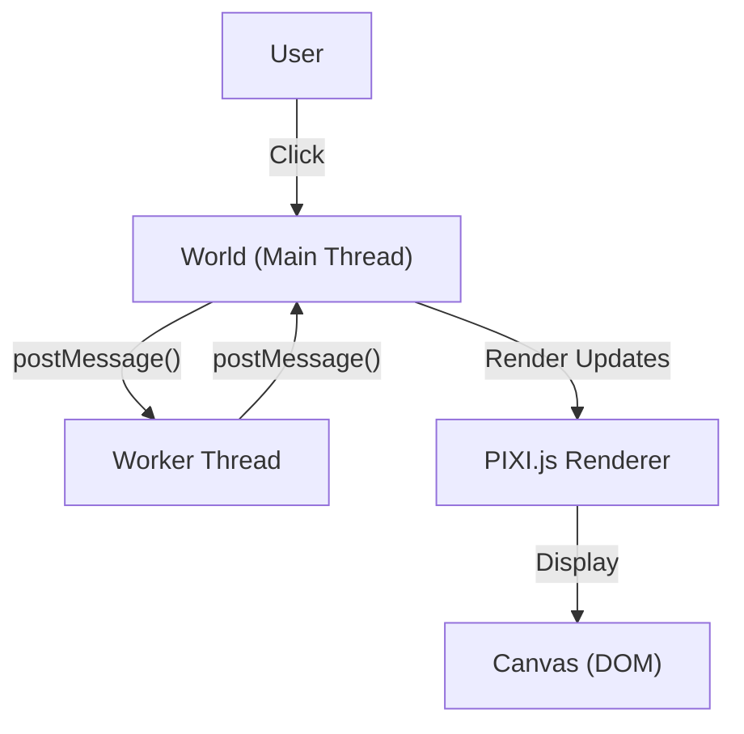
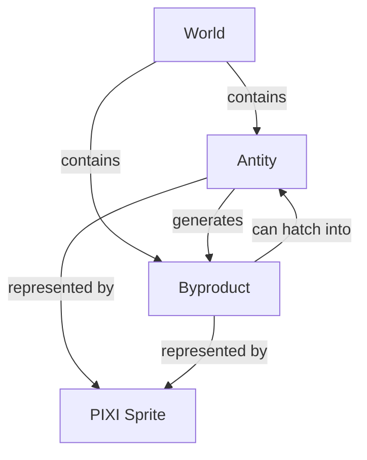
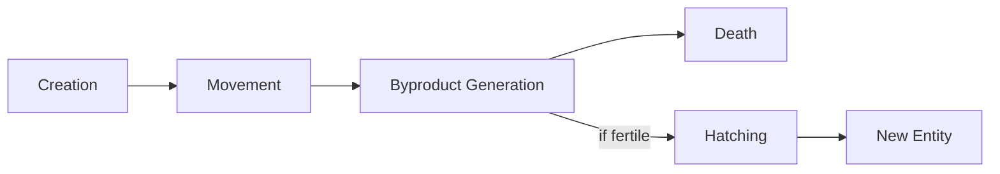
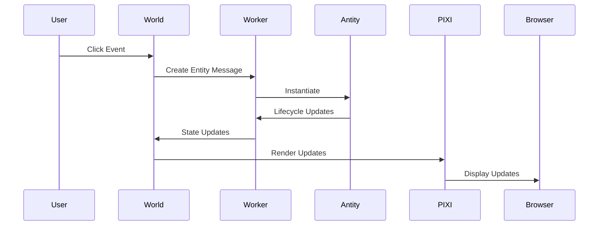

# System Patterns: Antity

## System Architecture

Antity employs a multi-layered architecture that separates rendering, logic, and state management:

### Key Components
1. **Main Thread (World)**: Handles rendering and DOM interaction
2. **Worker Thread**: Contains entity logic and lifecycle management
3. **Rendering Engine**: Uses PIXI.js for sprite-based rendering

## Design Patterns

### 1. Actor Model
Entities operate as independent actors with encapsulated state:
- Each Antity instance has its own lifecycle, state, and behavior
- Communication happens through message passing between actors

### 2. Web Worker Parallelism
- Each entity runs in its own worker thread
- Isolates computation from the rendering thread
- Uses message passing for communication
- Improves performance by offloading entity logic

### 3. Component-Based Entity System

Entities are composed of:
- Unique identifier (UUID)
- Position data (offset)
- Lifecycle state (alive/dead)
- Visual representation (sprite)
- Behavior patterns

### 4. Observer Pattern
- World object observes worker messages
- Listeners respond to specific message types
- Decouples entity logic from rendering

### 5. Factory Pattern
- World creates entities through a factory method (`startWorker`)
- Entities can spawn other entities (through fertile byproducts)

## Implementation Paths

### Entity Lifecycle

1. **Creation**: Entity instantiated by click or hatching
2. **Movement**: Random direction changes based on probability
3. **Byproduct Generation**: Chance-based creation of byproducts
4. **Reproduction**: Fertile byproducts incubate and hatch
5. **Death**: After lifespan expires

### Communication Flow

## Technical Constraints
1. **Worker Messaging Overhead**: Message passing has performance implications with many entities
2. **Synchronization Challenges**: Maintaining consistency between logic and rendering threads
3. **Rendering Performance**: PIXI ParticleContainer optimization for many sprites
4. **Browser Compatibility**: Web Worker and Canvas API dependencies

## Key Technical Decisions
1. Use of Web Workers for parallelization
2. PIXI.js as rendering engine for performance
3. UUID-based entity tracking
4. Probability-based behavior system
5. Sprite-based visual representation
