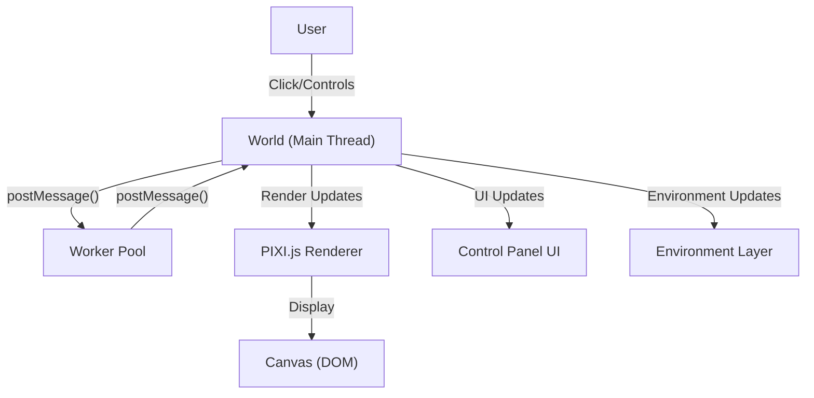
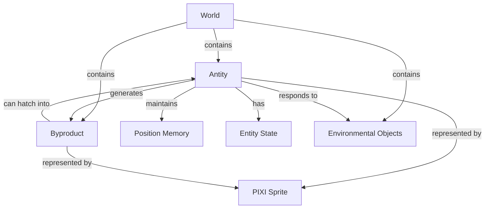
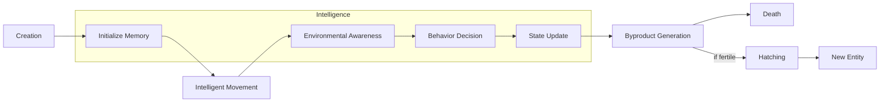
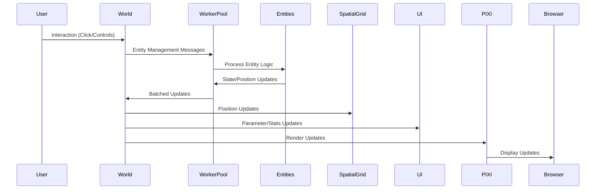

# System Patterns: Antity

## System Architecture

Antity employs a multi-layered architecture that separates rendering, logic, and state management:

### Key Components
1. **Main Thread (World)**: Handles rendering, DOM interaction, and spatial management
2. **Worker Pool**: Contains entity logic and lifecycle management for multiple entities
3. **Rendering Engine**: Uses PIXI.js for sprite-based rendering
4. **Control Panel UI**: Provides user controls for simulation parameters
5. **Environment Layer**: Manages environmental objects and influences

## Design Patterns

### 1. Actor Model
Entities operate as independent actors with encapsulated state:
- Each Antity instance has its own lifecycle, state, and behavior
- Communication happens through message passing between actors
- Enhanced with position memory and environmental awareness

### 2. Worker Pool Parallelism
- Multiple entities share worker threads in a pool
- Balances entities across available workers
- Reduces overhead while maintaining isolation
- Improves performance by limiting thread creation

### 3. Component-Based Entity System

Entities are composed of:
- Unique identifier (UUID)
- Position data (offset)
- Lifecycle state (alive/dead, young/mature/old)
- Visual representation (animated sprite)
- Behavior patterns (steering, memory, awareness)
- Position history (recent movements)

### 4. Observer Pattern
- World object observes worker messages
- Listeners respond to specific message types
- Enhanced to include environmental events
- UI components observe entity states for display

### 5. Factory Pattern
- World creates entities through a factory method (`startWorker`)
- Entities can spawn other entities (through fertile byproducts)
- Enhanced with worker pool assignment

### 6. Spatial Partitioning
- Grid-based spatial management for efficient entity tracking
- Optimizes rendering by culling off-screen entities
- Enables efficient proximity queries for environmental awareness

### 7. Object Pooling
- Reuses sprite objects for byproducts to reduce garbage collection
- Pre-allocates commonly used objects
- Improves memory usage and reduces stuttering

## Implementation Paths

### Enhanced Entity Lifecycle

1. **Creation**: Entity instantiated by click, hatching, or system
2. **Memory**: Track position history to avoid repetitive movement
3. **Movement**: Steering behaviors with randomness influence
4. **Awareness**: Detect nearby entities and environmental objects
5. **Decision**: Make movement/behavior choices based on surroundings
6. **State**: Update lifecycle state (young/mature/old)
7. **Byproduct**: Generate byproducts with varying fertility
8. **Death**: After lifespan expires
9. **Reproduction**: Fertile byproducts incubate and hatch

### Enhanced Communication Flow

## Technical Constraints
1. **Worker Pooling Balance**: Finding optimal number of workers vs. entities
2. **Synchronization Challenges**: Maintaining consistency with shared workers
3. **Rendering Performance**: Optimizing for many sprites with animation
4. **Memory Management**: Preventing leaks with object pooling
5. **UI Performance**: Ensuring controls don't impact simulation performance

## Key Technical Decisions
1. **Worker Pooling** for better performance with many entities
2. **Steering Behaviors** for more organic movement patterns
3. **Spatial Partitioning** for efficient proximity detection and rendering
4. **Object Pooling** for better memory management
5. **Enhanced Animation** for better visual representation
6. **Environment Interaction** for more complex behaviors
7. **UI Controls** for user parameter adjustment
