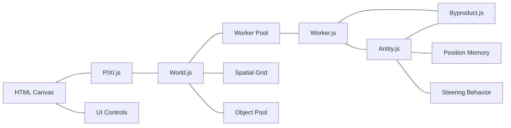

# Technical Context: Antity

## Technologies Used

### Core Technologies
1. **JavaScript**: Primary programming language
2. **HTML5/CSS3**: Structure and styling
3. **Canvas API**: Base rendering technology
4. **Web Workers API**: For parallel processing of entity logic

### Libraries
1. **PIXI.js**: High-performance 2D WebGL/Canvas rendering library
   - Used for sprite rendering and animation
   - Leverages hardware acceleration when available
   - Particle container for optimization
   - Animation frames for entity state visualization
   - Particle effects for key events (hatching, death)
   
2. **UUID.js**: For unique entity identification
   - Used to track entities and their byproducts
   - Enables reliable messaging between components

3. **jQuery**: Minimal usage for DOM manipulation and event handling
   - Click event handling
   - Window dimension calculations
   - UI control bindings

### Planned Technical Enhancements
1. **Worker Pooling**: Optimizing parallel processing
   - Shared worker threads for multiple entities
   - Balanced entity distribution across pool
   
2. **Spatial Partitioning**: Grid-based entity management
   - Efficient proximity queries
   - Visibility culling for rendering optimization
   
3. **Object Pooling**: Memory optimization
   - Pre-allocation of frequently used objects
   - Reduced garbage collection pressure

### Development Architecture

## Development Setup
The project uses a simple file structure with no build process:
- Direct script imports in HTML
- Script versioning via URL parameters to prevent caching during development
- No transpilation or bundling required
- CSS for UI control styling

## Technical Constraints

### Performance Considerations
1. **Rendering Optimization**:
   - Using ParticleContainer for performance with many sprites
   - Anchor-based positioning for smoother animation
   - Sprite texture caching
   - Spatial partitioning for visibility culling
   - Animation frame optimization

2. **Worker Processing**:
   - Worker pool instead of per-entity workers
   - Batched message passing to reduce overhead
   - Worker load balancing for optimal distribution
   - Worker lifecycle management to prevent memory leaks

3. **Animation Loop**:
   - requestAnimationFrame for smooth rendering
   - Separation of rendering and logic cycles
   - Throttling of entity logic via intervals
   - State-based animation frame selection

4. **Memory Management**:
   - Object pooling for frequently created/destroyed elements
   - Efficient cleanup of unused resources
   - Optimized sprite texture management

### Browser Compatibility
- Requires modern browsers with support for:
  - Web Workers API
  - Canvas/WebGL rendering
  - ES6 Classes
  - requestAnimationFrame
  - CSS Grid (for UI controls)

## Dependencies

### External Dependencies
- No external API dependencies
- All assets are self-contained
- No backend requirements

### Asset Dependencies
- Sprite sheets for visual representation:
  - `antity-spritesheet.png`: Contains entity and byproduct sprites
  - Planned expansion with additional animation frames
  - Environmental object sprites (food, barriers)
  - Particle effect sprites
  - Sprite frames defined programmatically

## Tool Usage Patterns

### Development Workflow
1. Edit source files directly
2. Refresh browser to see changes
3. Use browser console for debugging entity behavior
4. Performance testing with browser dev tools

### Debugging Approaches
1. Console.log statements (commented out in production)
2. Browser developer tools for inspecting:
   - Worker messages
   - Canvas rendering
   - Performance metrics (FPS, memory usage)
   - Entity counts and states

### Asset Management
- Sprite sheets organized by element type
- Frame selection based on entity state (Antity vs Byproduct vs Fertile)
- Dynamic texture frame selection
- Animation frames for different entity states
- Particle effect sprites for events

## Implementation Considerations

### Performance Optimization Strategy
1. **Worker Pooling**:
   - Reduce the number of active workers
   - Implement entity batching in shared workers
   - Balance worker load based on entity count

2. **Rendering Optimization**:
   - Implement spatial partitioning grid
   - Cull non-visible entities from rendering
   - Use object pooling for sprites
   - Optimize animation frame updates

3. **Memory Management**:
   - Implement object pooling for byproducts
   - Efficient cleanup of dead entities
   - Optimize texture caching and reuse

### UI Implementation
1. **Control Panel**:
   - Minimalist design to maintain focus on simulation
   - Range sliders for numeric parameters
   - Toggle buttons for simulation state
   - Dropdown selectors for environment tools

2. **Environment Controls**:
   - Tool selection for placing objects
   - Visual feedback for selected tools
   - Click interactions for object placement

### Future Technical Extensions
1. **Neural Networks**: For advanced entity behavior
   - Potential libraries: TensorFlow.js (lightweight version)
   - Simple neural networks for decision making

2. **Advanced Rendering**:
   - WebGL shaders for visual effects
   - More sophisticated animation systems
   - Dynamic lighting or environmental effects

3. **Data Persistence**:
   - Saving/loading simulation states
   - Exporting interesting configurations
