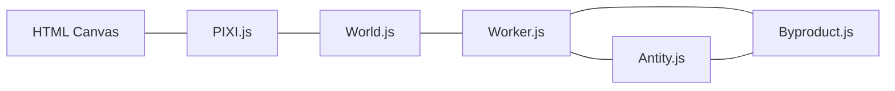

# Technical Context: Antity

## Technologies Used

### Core Technologies
1. **JavaScript**: Primary programming language
2. **HTML5/CSS3**: Structure and styling
3. **Canvas API**: Base rendering technology
4. **Web Workers API**: For parallel processing of entity logic

### Libraries
1. **PIXI.js**: High-performance 2D WebGL/Canvas rendering library
   - Used for sprite rendering and animation
   - Leverages hardware acceleration when available
   - Particle container for optimization
   
2. **UUID.js**: For unique entity identification
   - Used to track entities and their byproducts
   - Enables reliable messaging between components

3. **jQuery**: Minimal usage for DOM manipulation and event handling
   - Click event handling
   - Window dimension calculations

### Development Architecture

## Development Setup
The project uses a simple file structure with no build process:
- Direct script imports in HTML
- Script versioning via URL parameters to prevent caching during development
- No transpilation or bundling required

## Technical Constraints

### Performance Considerations
1. **Rendering Optimization**:
   - Using ParticleContainer for performance with many sprites
   - Anchor-based positioning for smoother animation
   - Sprite texture caching

2. **Worker Processing**:
   - Each entity runs in its own web worker
   - Communication via postMessage() API
   - Worker lifecycle management to prevent memory leaks

3. **Animation Loop**:
   - requestAnimationFrame for smooth rendering
   - Separation of rendering and logic cycles
   - Throttling of entity logic via intervals

### Browser Compatibility
- Requires modern browsers with support for:
  - Web Workers API
  - Canvas/WebGL rendering
  - ES6 Classes
  - requestAnimationFrame

## Dependencies

### External Dependencies
- No external API dependencies
- All assets are self-contained
- No backend requirements

### Asset Dependencies
- Sprite sheets for visual representation:
  - `antity-spritesheet.png`: Contains entity and byproduct sprites
  - Sprite frames defined programmatically

## Tool Usage Patterns

### Development Workflow
1. Edit source files directly
2. Refresh browser to see changes
3. Use browser console for debugging entity behavior

### Debugging Approaches
1. Console.log statements (commented out in production)
2. Browser developer tools for inspecting:
   - Worker messages
   - Canvas rendering
   - Performance metrics

### Asset Management
- Sprite sheets organized by element type
- Frame selection based on entity state (Antity vs Byproduct vs Fertile)
- Dynamic texture frame selection

## Technical Debt & Considerations

1. **Code Organization**:
   - Could benefit from more modular structure
   - Event-based communication could be formalized

2. **Performance Optimization**:
   - Worker creation/destruction is resource-intensive
   - Potential for object pooling to reduce GC pressure

3. **Rendering Improvements**:
   - WebGL for more complex visual effects
   - More sophisticated sprite animations

4. **Future Extensions**:
   - Neural network integration would require additional libraries
   - More complex behaviors may require more robust state management
